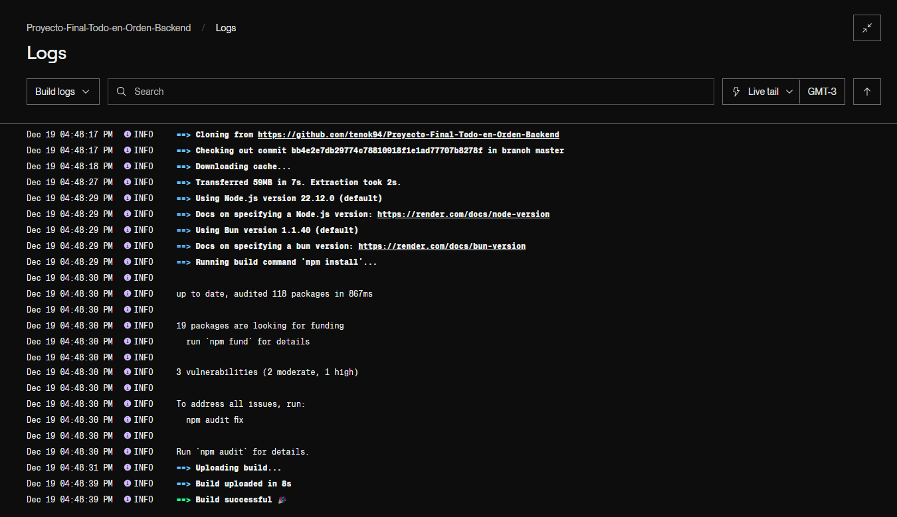

📝 Proyecto Final - Todo en Orden (Backend)

🚀 Descripción
El backend de "Todo en Orden" es el motor que gestiona las peticiones, procesando y almacenando las tareas en una base de datos MongoDB. Está diseñado para trabajar en conjunto con el frontend, proporcionando una API REST para realizar operaciones CRUD (Crear, Leer, Actualizar y Eliminar).

🛠 **Tecnologías Utilizadas**

- **Node.js**: Entorno de ejecución para JavaScript en el servidor.
- **Express.js**: Framework para la creación de rutas y manejo del servidor.
- **MongoDB**: Base de datos no relacional para almacenar las tareas.
- **Mongoose**: ODM para interactuar con MongoDB.
- **Render**: Plataforma utilizada para el despliegue del backend.

📂 **Estructura del Proyecto**

- 📦 **backend/**
  - 📁 **config/**  
    - `db.js`: Conexión a MongoDB
  - 📁 **models/**  
    - `tareamodel.js`: Esquema de la tarea
  - 📁 **routes/**  
    - `tareas.js`: Rutas relacionadas con las tareas
  - `.env`: Variables de entorno (excluido del repositorio)
  - `app.js`: Archivo principal del servidor
  - `package.json`: Dependencias y scripts del proyecto
  - `README.md`: Este archivo

📡 Endpoints del API
🎯 Tareas
1. GET /tareas

    . Descripción: Devuelve todas las tareas almacenadas.
    . Respuesta: Lista de tareas en formato JSON.
    . Ejemplo:
            [
                {
                "_id": "12345",
                "tarea": "Comprar leche",
                "descripcion": "Ir al supermercado",
                "prioridad": "Alta",
                "estado": "Pendiente"
                }
            ]

2. POST /tareas

    . Descripción: Crea una nueva tarea.
    . Parámetros Requeridos:
                {
                "tarea": "String",
                "descripcion": "String",
                "prioridad": "String",
                "estado": "String"
                }
3. PUT /tareas/:id

    . Descripción: Actualiza una tarea existente.
    . Parámetros Requeridos: Mismos que en el POST.

4. DELETE /tareas/:id

    . Descripción: Elimina una tarea por su ID.

⚙️ Cómo Correr el Proyecto
    1. Clonar el repositorio:
            git clone https://github.com/usuario/backend-repo.git
            cd backend-repo

    2. Instalar dependencias:
            npm install

    3. Configurar variables de entorno: Crear un archivo .env en la raíz del  
       proyecto.

    4. Iniciar el Servidor:
        npm start

🚀 Despliegue

El backend está desplegado en Render y se puede acceder a través del siguiente enlace:
        https://proyecto-final-todo-en-orden-backend.onrender.com

🖼 Capturas de Pantalla

1️⃣ Logs de Render:

2️⃣ Respuesta de /tareas:

🔄 Flujo de Trabajo
1. Recepción de Peticiones: El backend recibe las peticiones enviadas desde el  
   frontend.
   
2. Procesamiento: Valida los datos y realiza las operaciones correspondientes en 
   MongoDB.

3. Respuesta: Devuelve la información procesada al frontend para su 
   visualización.
